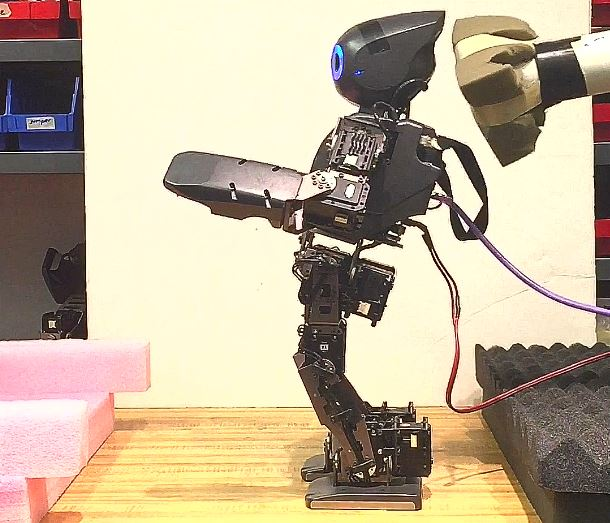
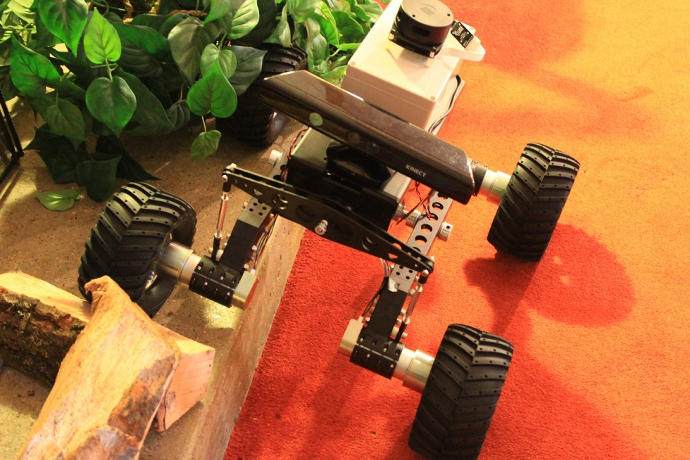
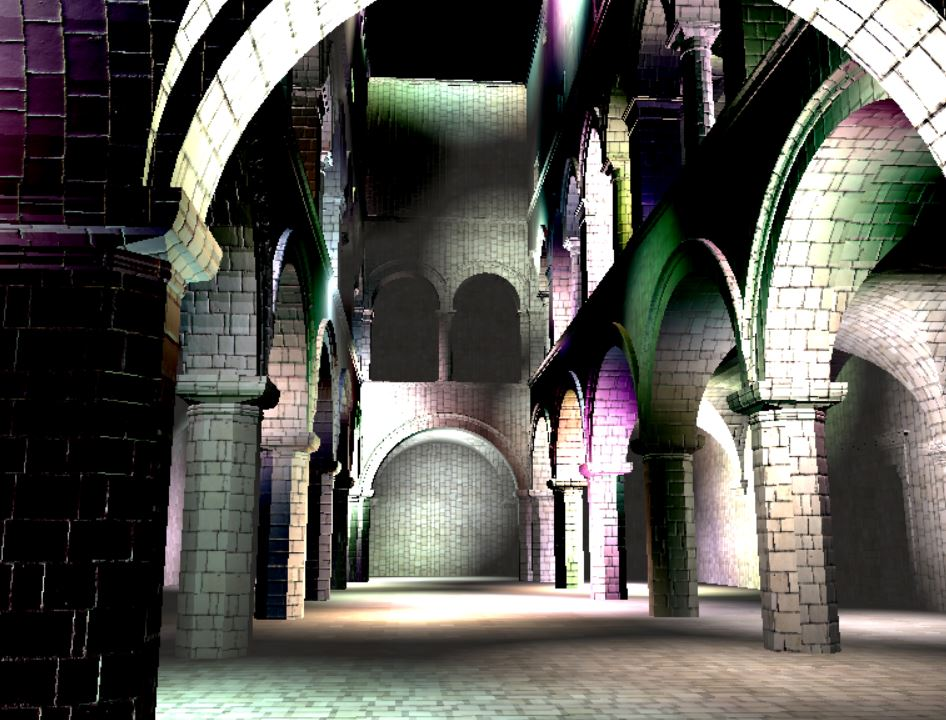
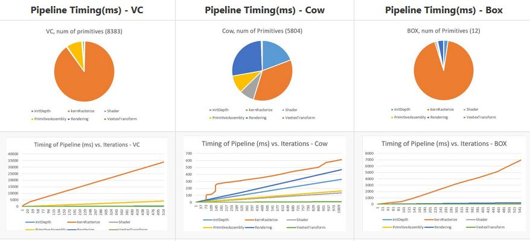
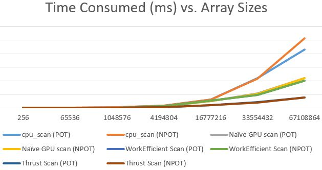
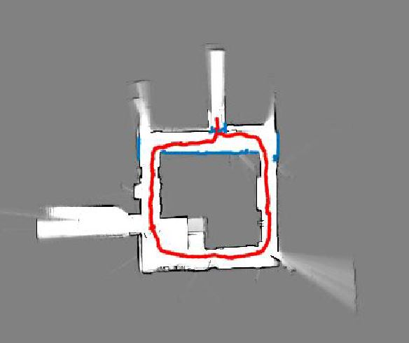
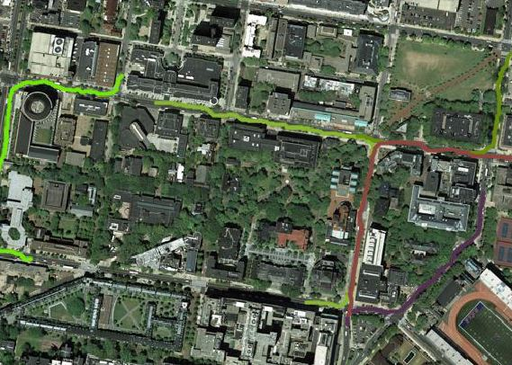
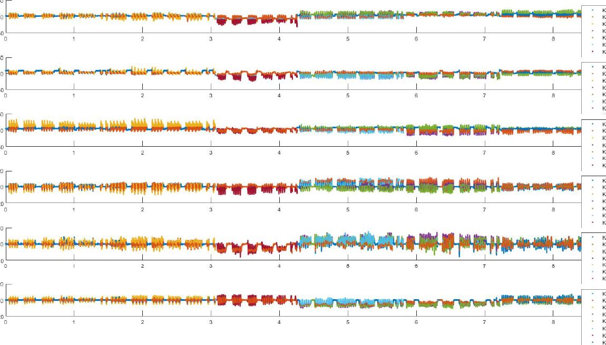

## Deng, Xiang  

# Introduction

I am currently studying Robotics at U.Penn. Prior to my study at Penn, I was pursuing my BS with Honors degree at the Univ. of 
Wisconsin Madsion. I think what I have done best decribes myself:

Current Research on Humanoid Robot Balancing | Undergraduate Thesis 
:-------------------------:|:-------------------------: 
 | 
[repo link](https://github.com/dengxianga/Supplementy-Webpage) | [repo link](http://sethares.engr.wisc.edu/XiangThesis/index.html)
 

### A collection of CUDA projects

WebGL Deferred Shading | CUDA Rasterizer
:-------------------------:|:-------------------------: 
 |  
[repo link](https://github.com/dengxianga/Project5-WebGL-Deferred-Shading-with-glTF) |  [repo link](https://github.com/dengxianga/Project4-CUDA-Rasterizer)

CUDA Path Tracer | Stream Compaction
:-------------------------:|:-------------------------: 
 |  
[repo link](https://github.com/dengxianga/Project3-CUDA-Path-Tracer) |  [repo link](https://github.com/dengxianga/Project2-Stream-Compaction)

### A collection of Learning in robotics reports

SLAM with particle filters | Path planning with imitation learning | Gesture Recognition with Cascaded HMM
:-------------------------:  |:-------------------------: |:-------------------------: 
 |  |  )]

#### CUDA-Based-Fast-and-Accurate-Image-Feature-Matching-for-Large-Scale-Dataset

[repo link](https://github.com/dengxianga/CUDA-Based-Fast-and-Accurate-Image-Feature-Matching-for-Large-Scale-Dataset)

## More comming soon..

===============================================
  dxiang at seas upenn 